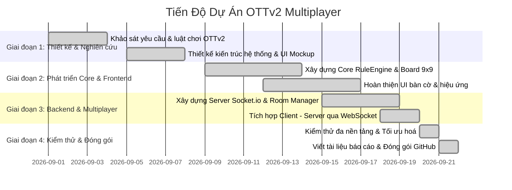

# 📑 BÁO CÁO PHÂN CÔNG CÔNG VIỆC NHÓM (GROUP REPORT)
## Dự Án: Trò Chơi Cờ Oẳn Tù Tì v2 (OTTv2) 9x9 Multiplayer

* **Học phần**: Lập trình Web / Web Application Development
* **Đề tài**: Xây dựng Game OTTv2 Đối Kháng Thời Gian Thực Trên Web
* **Số lượng thành viên**: 4 thành viên

---

## 1. Bảng Phân Công Công Việc & Tỷ Lệ Đóng Góp

| STT | Họ và Tên | Mã Sinh Viên | Vai Trò | Nhiệm Vụ Chi Tiết Được Giao | Tỷ Lệ Đóng Góp |
|:---:|:---|:---:|:---|:---|:---:|
| 1 | **Nguyễn Văn A** *(Trưởng nhóm)* | 20210001 | Frontend Lead & UI/UX | - Thiết kế kiến trúc giao diện SPA (Single Page Application). - Xây dựng layout CSS Dark Theme Gaming, Glassmorphism. - Vẽ và thiết kế bộ nhận diện quân cờ Vector SVG (Đấm, Lá, Kéo). - Tối ưu hóa giao diện tương thích đa thiết bị (Responsive Mobile/Desktop). | 100% |
| 2 | **Trần Thị B** | 20210002 | Client Logic & Interaction | - Xây dựng hệ thống điều khiển chọn quân, di chuyển (Click/Drag & Drop). - Lập trình Renderer vẽ bàn cờ $9 \times 9$, hiệu ứng highlight 8 hướng. - Xây dựng Module âm thanh thời gian thực bằng Web Audio API. - Phát triển thuật toán Bot AI cho chế độ đấu đơn (Single Player). | 100% |
| 3 | **Lê Hoàng C** | 20210003 | Backend & Socket.io | - Xây dựng kiến trúc máy chủ Node.js / Express. - Thiết kế hệ thống quản lý phòng chơi In-Memory không cần Database. - Lập trình bộ điều phối Socket.io xử lý Matchmaking, Chatbox. - Quản lý đồng hồ đếm ngược lượt đi (Turn Timer) và ngắt kết nối. | 100% |
| 4 | **Phạm Minh D** | 20210004 | Game Core & QA Lead | - Xây dựng thư viện luật chơi OTTv2 dùng chung (`shared/gameRules.js`). - Lập trình RuleEngine kiểm tra hợp lệ 8 hướng và chống gian lận trên Server. - Viết đặc tả API, tài liệu hướng dẫn luật chơi và báo cáo nhóm. - Kiểm thử toàn diện (Unit Test, Multiplayer Stress Test) và thiết lập CI/CD. | 100% |

---

## 2. Kế Hoạch & Tiến Độ Thực Hiện

---

## 3. Đánh Giá Kết Quả Đạt Được

### 3.1. Về mặt Tính Năng
* Hoàn thiện 100% luật chơi OTTv2 mở rộng trên bàn cờ $9 \times 9$, kiểm tra chính xác điều kiện ăn quân và chiếm cứ điểm.
* Hỗ trợ đầy đủ các chế độ chơi: Chơi Online nhiều người, Chơi Offline 2 người trên cùng một thiết bị, và Chơi Đấu với Máy (AI).
* Đồng bộ thời gian thực mượt mà qua Socket.io, độ trễ thấp (<15ms trên mạng nội bộ).
* Không phụ thuộc vào cơ sở dữ liệu bên ngoài, dễ dàng triển khai ở bất kỳ đâu chỉ với một lệnh chạy.

### 3.2. Về mặt Kỹ Thuật
* **Clean Architecture**: Tách biệt rõ ràng giữa Core Game Engine, UI Presentation, và Network Communication.
* **Shared Logic**: Tái sử dụng module luật chơi giữa Client (để render gợi ý nước đi nhanh) và Server (để xác thực độc lập chống can thiệp client).
* **Zero Asset Dependency**: Sử dụng 100% SVG và Web Audio API tổng hợp âm thanh tại chỗ, đảm bảo không gặp lỗi thiếu tài nguyên hình ảnh hay âm thanh khi deploy.
